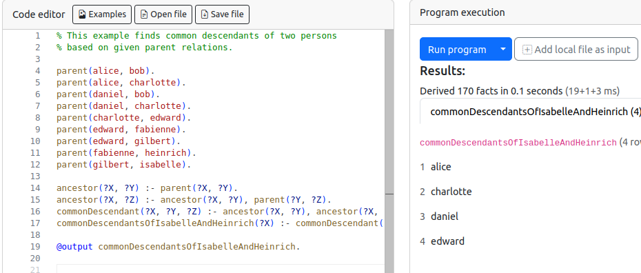
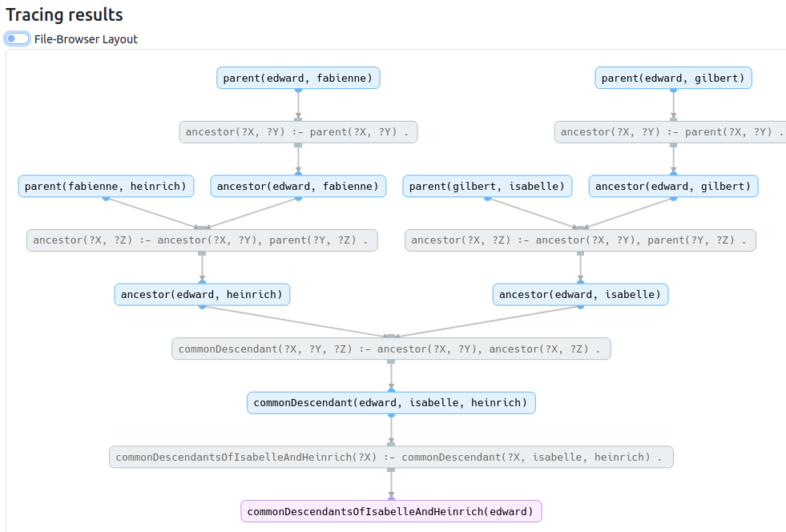

To get started with Nemo without any installation process check out our [interactive browser tool](https://tools.iccl.inf.tu-dresden.de/nemo). It is easy to use and supports code editing: 

---

If you want like to reproduce how a certain result is computed, click the grey button to see its trace.
For example, the image below shows how the fact `commonDescendantsOfIsabelleAndHeinrich(edward)` is computed:

