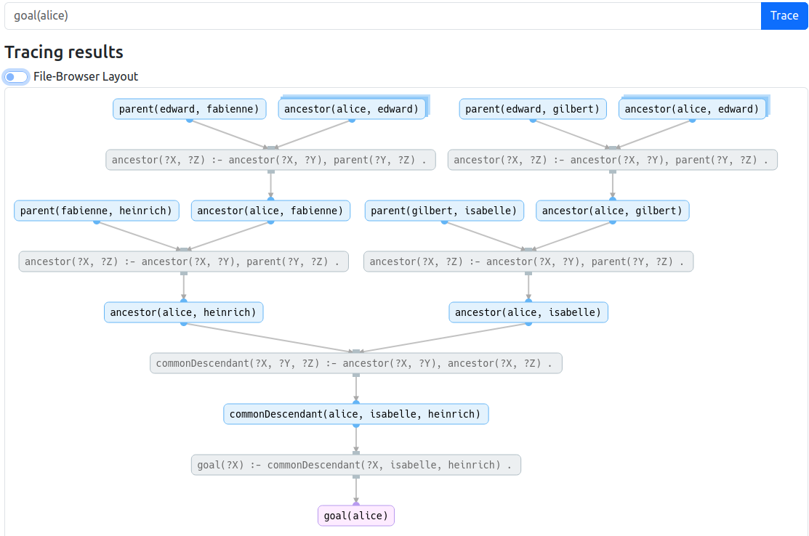

To get started with Nemo without any installation process check out our [interactive browser tool](https://tools.iccl.inf.tu-dresden.de/nemo). It is easy to use and supports code editing: 

---

To understand why a certain result is computed, select the grey button behind any result to see its trace.
For example, the image below shows how the trace of `goal(alice)` that describes why `alice` is a common descendant of `isabelle` and `heinrich`:

