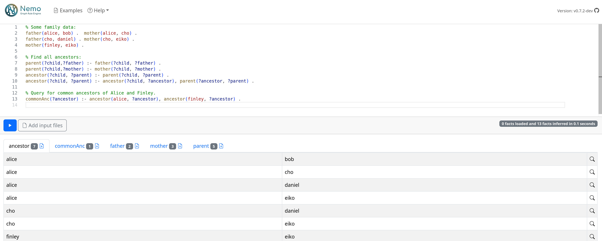
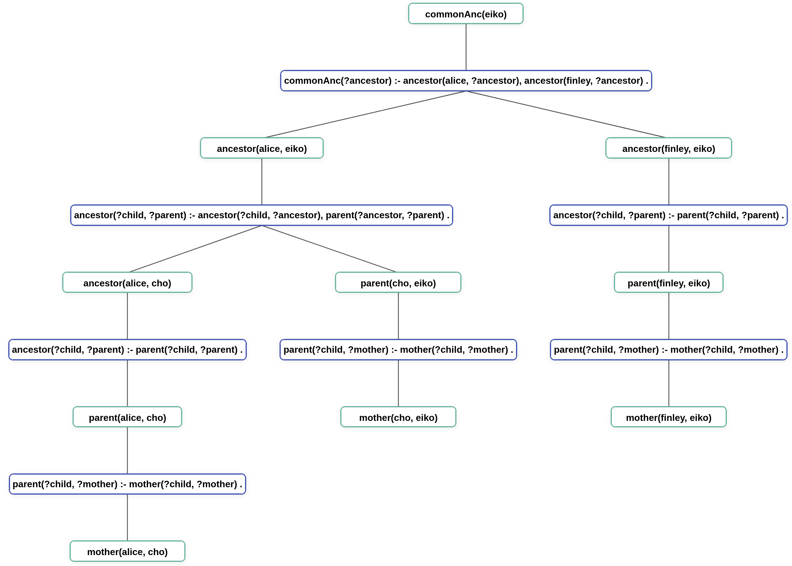

The easiest way to use Nemo is via our browser-based user interface Nemo Web, which can be found at https://tools.iccl.inf.tu-dresden.de/nemo. It allows you to write and run Nemo programs on your computer without prior installation.

### Main functionality

The main functions of the Web interface are:
- **Exploring Nemo examples** from the example collections ("Examples" button in the toolbar).
- **Editing** Nemo programs in a rich IDE with syntax highlighting and editing features. For example, you can use F2 to rename the symbol under the cursor.
- **Running** Nemo programs ("Play" button) and viewing results. The computation of results happens in your browser, on your machine (Nemo Web is a WASM application).
- **Downloading** results (download buttons in result tabs).
- **Using local files** as additional inputs ("Add input files"). Once added, files can be imported by their name as if they were in the working directory of the program. Since nemo runs locally in your browser, files are not uploaded anywhere (Nemo programs that interact with external services might still transmit some local data).
- **Explaining** inference results (experimental, see below).

To report bugs and request improvements, users can submit issues at the [Nemo Web issue tracker](https://github.com/knowsys/nemo-web/issues).

### Explanation of inferences

Nemo can compute **traces** to explain why and how a particular result was computed. On Nemo Web, an experimental interface is available to visualize traces as proof trees. The magnifier button on the right of each inferred result can be used to open it. For example, the following screenshot shows how the fact `commonAnc(eiko)` was derived in the basic Ancestors example.

This feature and the interface is still experimental, and it has some known limitations. The visualisation component is the [Nemo Explanation Visualizer](https://github.com/imldresden/nev).
